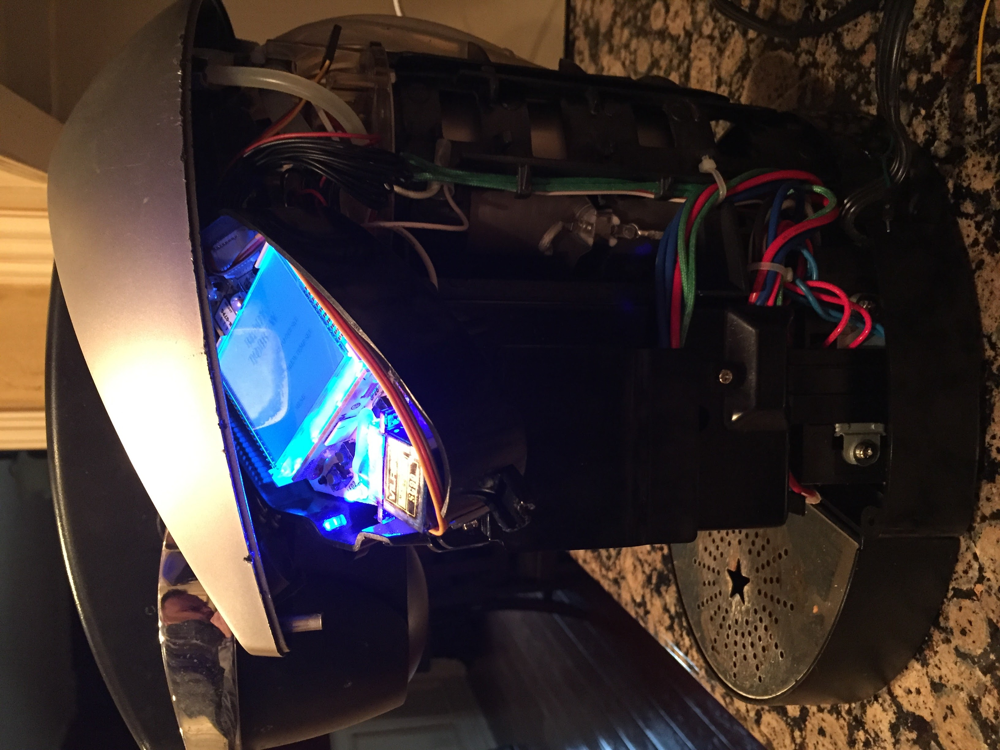
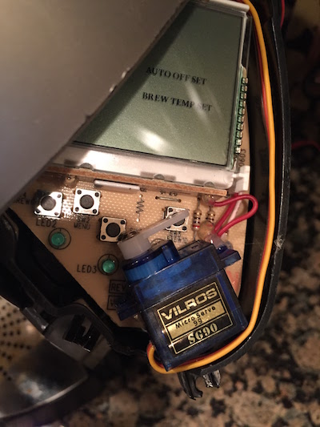

# Alexa-Keurig

## Description
Control your Keurig B60 through your Amazon Echo, using the Alexa Skills Kit and AWS IOT service. You'll create an Alexa Skills Kit (ASK) app that fires off requests to AWS Lambda. You will register a Rasberry Pi as a [device](https://docs.aws.amazon.com/iot/latest/developerguide/create-thing.html) in AWS IoT. The Alexa app will call a function in Lambda, which will send a request to the Pi to activate a servo, which pushes down the brew button. Yes, it's a hack, but it's fun.

## Usage
1. Create an Alexa Skills Kit (ASK) app, using the intent schema and sample utterances in this repo. Choose an invocation name like _my Keurig_.
2. Use the code in `main.py` as your Lambda function that the ASK skill will call. Substitute `amzn1.echo-sdk-ams.app.<your-alexa-skills-id>` with the ID of the ASK skill you created. When you create the function, set the "Event Source" to the Alexa Skills Kit.
4. Modify your ASK skill with the [ARN](http://docs.aws.amazon.com/general/latest/gr/aws-arns-and-namespaces.html) of your newly created Lambda function.
5. Wire up a Raspberry Pi according to the schematic in [RPiKeurig_bb.png](/RPiKeurig_bb.png). The servo should be glued in place underneath the plastic silver top (see *Caveats*), so that when it fires, it rotates to push one of the brew buttons. I use the largest button.

6. Test your interactions with the ASK console. When you've got it working, try it on your Echo: `Alexa, ask my Keurig to brew me a cup of coffee.`

## Caveat
- *YOU WILL MOST LIKELY DAMAGE YOUR KEURIG--AND VOID YOUR WARRANTY--IF YOU DO THIS.* There are YouTube videos on how to do the dismantling, but _this is the hardest part._ You only need access to the buttons underneath the plastic silver top that covers the LCD and buttons.

## Final Product

## Alexa Skills Kit Documentation
The documentation for the Alexa Skills Kit is available on the [Amazon Apps and Services Developer Portal](https://developer.amazon.com/appsandservices/solutions/alexa/alexa-skills-kit/).

## Resources
Here are a few direct links to Alexa and Lambda documentation:

- [Getting Started](https://developer.amazon.com/appsandservices/solutions/alexa/alexa-skills-kit/getting-started-guide)
- [Invocation Name Guidelines](https://developer.amazon.com/public/solutions/alexa/alexa-skills-kit/docs/choosing-the-invocation-name-for-an-alexa-skill)
- [Developing an Alexa Skill as an AWS Lambda Function](https://developer.amazon.com/appsandservices/solutions/alexa/alexa-skills-kit/docs/developing-an-alexa-skill-as-a-lambda-function)

## Disclaimers
The authors claim no responsibility for damages to your Keurig or property by use of the code within. You may incur charges using AWS Lambda, but there is a free tier available for up to 1M requests per month that you may be eligible for--check [AWS Lambda Pricing](https://aws.amazon.com/lambda/pricing/) for details.

## License
This is free and unencumbered software released into the public domain.

Anyone is free to copy, modify, publish, use, compile, sell, or
distribute this software, either in source code form or as a compiled
binary, for any purpose, commercial or non-commercial, and by any
means.

In jurisdictions that recognize copyright laws, the author or authors
of this software dedicate any and all copyright interest in the
software to the public domain. We make this dedication for the benefit
of the public at large and to the detriment of our heirs and
successors. We intend this dedication to be an overt act of
relinquishment in perpetuity of all present and future rights to this
software under copyright law.

THE SOFTWARE IS PROVIDED "AS IS", WITHOUT WARRANTY OF ANY KIND,
EXPRESS OR IMPLIED, INCLUDING BUT NOT LIMITED TO THE WARRANTIES OF
MERCHANTABILITY, FITNESS FOR A PARTICULAR PURPOSE AND NONINFRINGEMENT.
IN NO EVENT SHALL THE AUTHORS BE LIABLE FOR ANY CLAIM, DAMAGES OR
OTHER LIABILITY, WHETHER IN AN ACTION OF CONTRACT, TORT OR OTHERWISE,
ARISING FROM, OUT OF OR IN CONNECTION WITH THE SOFTWARE OR THE USE OR
OTHER DEALINGS IN THE SOFTWARE.

For more information, please refer to <http://unlicense.org>
